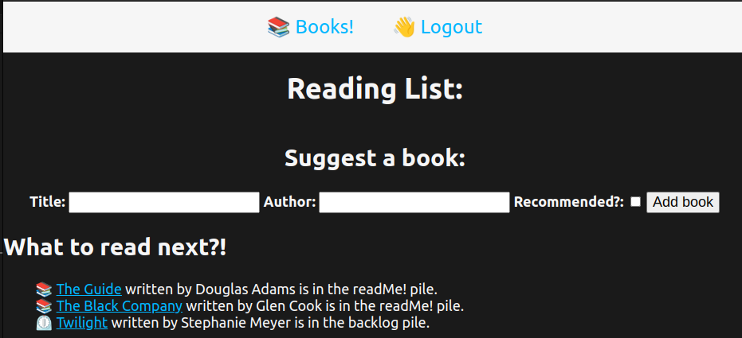

## Suggested Reading List:
I created this app to help track upcoming books I would like to read as well as provide an avenue for friends and family to make recommendations about what they think I should read next (or what I should avoid reading if they think it should collect dust on my backlog pile).

Leave me a recommendation [here!](https://mikes-reading-list.fly.dev/)

## Technologies used:
1. MEN Stack (MongoDB/Mongoose, Express, and Node.js)
2. Google 0Auth
3. EJS
4. Git
5. [GitHub](https://github.com/MendersGame/readingList)
6. [Trello](https://trello.com/b/hH0LyqUq/unit-2-project)
7. [Whimsical](https://whimsical.com/bookshelfwireframes-ZbRPQPSeBHSZskgnkvxZp)

## Icebox (future plans):
1. Create an author model and page to track and display all books written by a particular author
2. Add cover art for books when viewing a particular book in the show view
3. Add tracking to differentiate between an individual novel, and a book in a series
